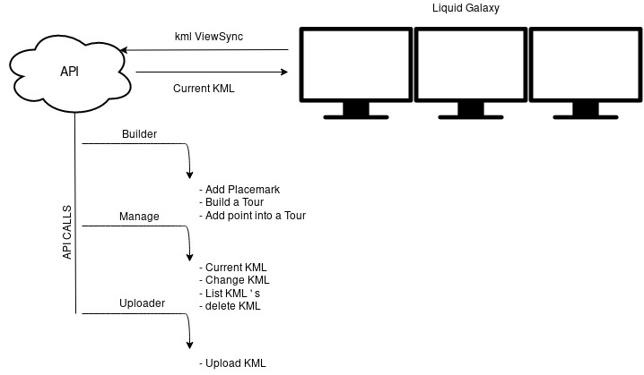

# Liquid Galaxy KML API

> This project will be developed for the **GSOC 2019** program

> All the **API documentation** after the installation will be found accessing:
**http://SERVERIP:PORT/docs**

## Introduction

The system will interact over the liquid galaxy using a KML with a network link.

This KML will do requests to our API. And this one will control which data will be sent to the system.

Here we can see a project scheme:



You can build new KML and concatenate your own kmls to the current one.

But if you use the upload call, you will just be able to display this one

## Installation

Clone the repository into your computer, then get into the folder.


I prepared a simple command to install the api.

If you are using liquid galaxy on UBUNTU 16 use the following instruction:

```sh
./installUbuntu16.sh
KMLSERVERIP=' THE IP OF THE MACHINE WHERE THE KMLAPI WILL BE INSTALLED'
KMLSERVERPORT="the port of the API" USE AN OPEN NETWORK PORT!
```

Ubuntu 18:
```sh
./installUbuntu18.sh
KMLSERVERIP=' THE IP OF THE MACHINE WHERE THE KMLAPI WILL BE INSTALLED'
KMLSERVERPORT="the port of the API" USE AN OPEN NETWORK PORT!
```

This script needs to be executed in the master, because it will elaborate the NetworkLink and share with the slaves, to automatize the configuration process.


## Server DEPLOY

After run the install.sh, get into the root of the repository:

```bash
npm install
```
to install all the dependencies, then reboot the server system.

Finally run the server:

```js
node server.js
```
**OBS:** If the system says that some package it's not installed install them one by one

You can check what's your liquid galaxy master receiving by accessing the next URL:

```url
http://MACHINEIP:PORT/kml/viewsync/master
```

## Test

To test:
```url
/* http://MACHINEIP:PORT/kml/flyto/:lon/:lat/:range */
http://MACHINEIP:PORT/kml/flyto/10/10/1000
```
if the liquid galaxy moves to the specified place, the API **is working well!!**

## Documentation
You can find all the API calls by accessing into:
```url
http://MACHINEIP:PORT/docs
```
**ENJOY THE API :)**
